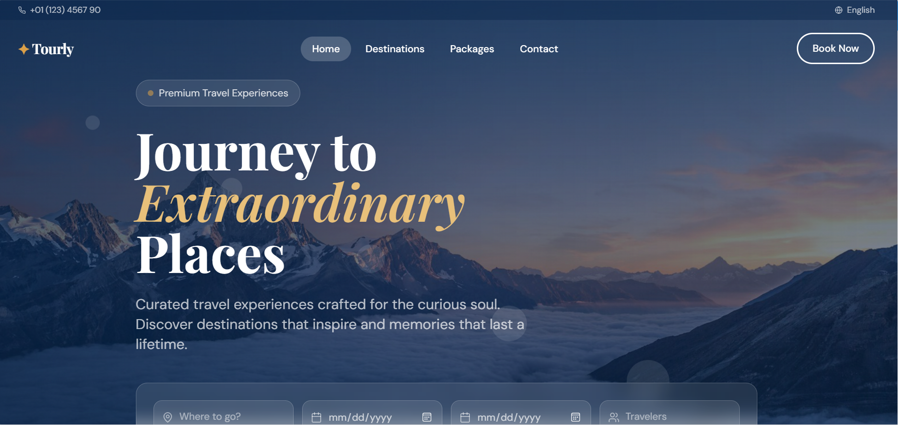
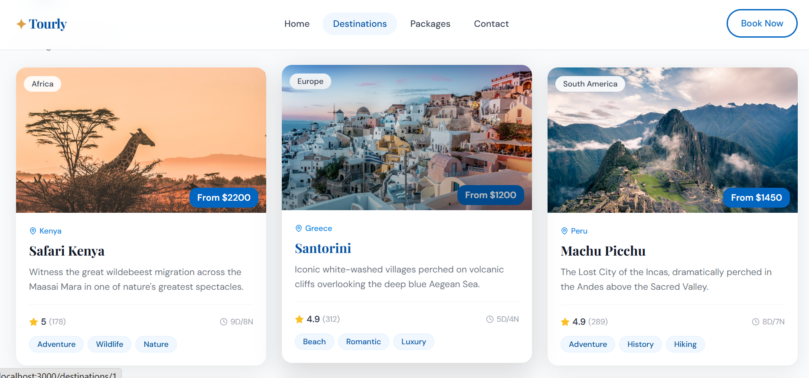

# ✈️ Tourly — Premium Travel Web Application

<p align="center">
Explore, discover, and plan memorable journeys through a modern travel experience.
</p>

<p align="center">


</p>

---

## 🔗 Quick Links

🌐 Live Demo: [Add Deployment URL]

📖 Documentation: [Project Docs]

🐛 Report Issue: [GitHub Issues]

💡 Request Feature: [GitHub Discussions]

---

# 📌 About The Project

Tourly is a modern full-stack travel platform designed to provide users with an engaging and visually rich travel experience.

The platform enables users to discover destinations, explore travel packages, browse testimonials, and interact with dynamic travel content through a clean and responsive interface.

Traditional travel websites often contain cluttered interfaces and poor responsiveness. Tourly solves this by focusing on:

- Modern UI/UX
- Fast performance
- Responsive design
- Reusable architecture
- Smooth interactions

The application simulates a production-ready travel ecosystem using static JSON data and scalable frontend/backend architecture.

---

# 🖥️ Project Preview

## Desktop View



---


## Destination Page



---

## Travel Package Page


---

# ✨ Key Features

🌍 Browse and explore travel destinations

🔍 Smart filtering and search functionality

🎯 Discover curated travel packages

📷 Interactive image gallery

⭐ Testimonials carousel

📩 Newsletter subscription system

📱 Fully responsive UI

⚡ Optimized rendering performance

✨ Smooth animations and transitions

🚫 Friendly custom 404 page

---

# 🚀 Technology Stack

## Frontend

| Technology | Purpose |
|------------|----------|
| React 18 | UI Development |
| Vite | Build Tool |
| React Router v6 | Routing |
| TailwindCSS | Styling |

---

## Backend

| Technology | Purpose |
|------------|----------|
| Node.js | Runtime Environment |
| Express | API Server |

---

## Libraries

| Library | Purpose |
|----------|----------|
| Axios | API Requests |
| Lucide React | Icons |
| React Hot Toast | Notifications |

---

## Development Tools

| Tool | Purpose |
|-------|----------|
| Git | Version Control |
| npm | Package Management |
| VS Code | Development |

---

# 📁 Project Architecture

```bash
tourly/
│
├── client/
│   ├── src/
│   │   ├── components/
│   │   │   ├── layout/
│   │   │   ├── sections/
│   │   │   └── ui/
│   │   │
│   │   ├── pages/
│   │   ├── hooks/
│   │   ├── utils/
│   │   └── App.jsx
│
└── server/
    ├── data/
    ├── server.js
    └── package.json
```

### Folder Explanation

| Folder | Purpose |
|----------|----------|
| components | Reusable UI components |
| pages | Application pages |
| hooks | Custom React hooks |
| utils | API helper functions |
| server | Backend APIs |
| data | Static JSON data |

---

# 🔄 Application Workflow

```text
User
 ↓
Homepage
 ↓
Browse Destinations
 ↓
Destination Details
 ↓
Travel Packages
 ↓
Contact / Newsletter
 ↓
Express API
 ↓
Response Returned
```

---

# 🌐 API Documentation

| Method | Endpoint | Description |
|----------|-----------|-------------|
| GET | /api/destinations | Get all destinations |
| GET | /api/destinations/:id | Get single destination |
| GET | /api/packages | Get all packages |
| GET | /api/packages/:id | Get package details |
| GET | /api/testimonials | Get testimonials |
| POST | /api/search | Search tours |
| POST | /api/newsletter | Newsletter subscription |
| POST | /api/contact | Contact form submission |

### Query Examples

```bash
GET /api/destinations?region=Europe&featured=true

GET /api/packages?category=luxury&maxPrice=3000
```

---

# ⚙️ Installation & Setup

### Clone Repository

```bash
git clone https://github.com/vinushinde2525-sys/tourly-premium-travel-platform.git
```

### Navigate to Project

```bash
cd tourly
```

### Install Dependencies

```bash
npm install

cd client
npm install

cd ../server
npm install
```

### Run Project

```bash
npm run dev
```

Frontend:

```bash
http://localhost:3000
```

Backend:

```bash
http://localhost:5000/api
```

---

# ⚡ Performance Optimizations

### Implemented Optimizations

✔ Component reusability

✔ Custom React hooks

✔ API abstraction layer

✔ Responsive design

✔ Optimized rendering

✔ Modular architecture

✔ Clean code structure

---

# 🧩 Challenges & Solutions

### Challenge:
Maintaining responsiveness across devices

### Solution:
Implemented TailwindCSS responsive utilities and reusable layouts

---

### Challenge:
Keeping code scalable

### Solution:
Adopted component-based architecture

---

### Challenge:
Managing reusable API logic

### Solution:
Created centralized API helper functions

---

# 📄 Resume Highlights

• Built a full-stack travel web application using React, Vite, Node.js, and Express.

• Developed reusable component architecture improving maintainability and scalability.

• Implemented dynamic filtering and search functionality.

• Designed responsive interfaces for seamless cross-device user experience.

• Created REST APIs using Express with structured endpoint management.

---

# 🔮 Future Enhancements

🤖 AI-based travel recommendations

💳 Payment integration

🔐 Authentication system

🗺️ Maps integration

📊 Admin dashboard

📅 Booking management system

❤️ Wishlist functionality

---

# 🤝 Contribution

Contributions, feature suggestions, and pull requests are welcome.

```bash
Fork Repository

Create Branch

Commit Changes

Push Changes

Open Pull Request
```

---

# 👨‍💻 Author

**Vinayak madan shinde**

GitHub: https://github.com/vinushinde2525-sys


---

<p align="center">
Made with ❤️ using React + Node.js
</p>